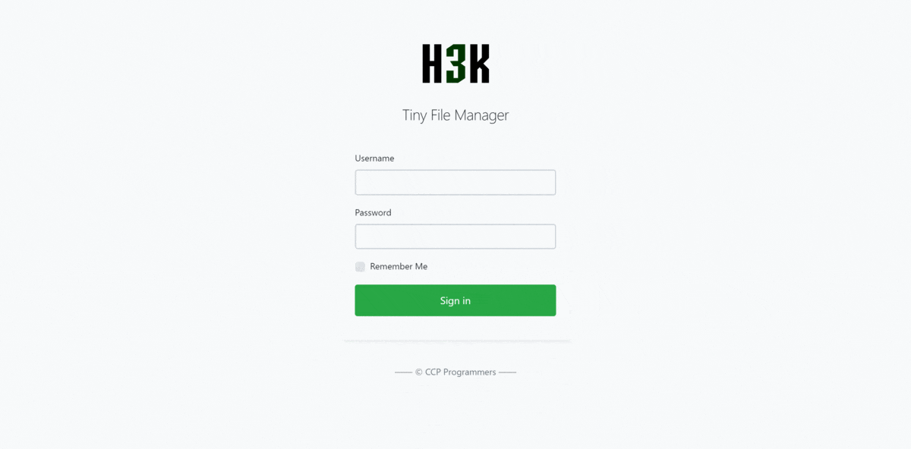

<!--
N.B.: This README was automatically generated by https://github.com/YunoHost/apps/tree/master/tools/README-generator
It shall NOT be edited by hand.
-->

# Tiny File Manager for YunoHost

[](https://dash.yunohost.org/appci/app/tinyfilemanager)    
[](https://install-app.yunohost.org/?app=tinyfilemanager)

*[Lire ce readme en français.](./README_fr.md)*

> *This package allows you to install Tiny File Manager quickly and simply on a YunoHost server.
If you don't have YunoHost, please consult [the guide](https://yunohost.org/#/install) to learn how to install it.*

## Overview

# Tiny File Manager

[](https://tinyfilemanager.github.io/demo/)
[](https://github.com/prasathmani/tinyfilemanager/wiki)
[](https://github.com/prasathmani/tinyfilemanager/releases)
[](https://github.com/prasathmani/tinyfilemanager/blob/master/LICENSE)
[](https://www.paypal.me/prasathmani)

> TinyFileManager is web based file manager and it is a simple, fast and small file manager with a single file, multi-language ready web application for storing, uploading, editing and managing files and folders online via web browser. The Application runs on PHP 5.5+, It allows the creation of multiple users and each user can have its own directory and a build-in support for managing text files with cloud9 IDE and it supports syntax highlighting for over 150+ languages and over 35+ themes.

## Demo

[Demo](https://tinyfilemanager.github.io/demo/)


## Documentation

Tinyfilemanager is highly documented on the [wiki pages](https://github.com/prasathmani/tinyfilemanager/wiki).

### :loudspeaker: Features

- :cd: Open Source, light and extremely simple
- :iphone: Mobile friendly view for touch devices
- :information_source: Basic features likes Create, Delete, Modify, View, Quick Preview, Download, Copy and Move files
- :arrow_double_up: Ajax Upload, Ability to drag & drop, upload from URL, multiple files upload with file extensions filter
- :file_folder: Ability to create folders and files
- :gift: Ability to compress, extract files (`zip`, `tar`)
- :sunglasses: Support user permissions - based on session and each user root folder mapping
- :floppy_disk: Copy direct file URL
- :pencil2: Cloud9 IDE - Syntax highlighting for over `150+` languages, Over `35+` themes with your favorite programming style
- :page_facing_up: Google/Microsoft doc viewer helps you preview `PDF/DOC/XLS/PPT/etc`. 25 MB can be previewed with the Google Drive viewer
- :zap: Backup files and IP blacklist and whitelist
- :mag_right: Search - Search and filter files using `datatable js`
- :file_folder: Exclude folders and files from listing
- :globe_with_meridians: Multi-language(20+) support and for translations `translation.json` is file required
- :bangbang: lots more...


**Shipped version:** 2.4.7~ynh1

**Demo:** https://tinyfilemanager.github.io/demo/

## Screenshots



## Disclaimers / important information

## Requirements

- PHP 5.5.0 or higher.
- Fileinfo, iconv, zip, tar and mbstring extensions are strongly recommended.

## How to use

:warning: Warning: password is encrypted with <code>password_hash()</code>. to generate new password hash [here](https://tinyfilemanager.github.io/docs/pwd.html)

To enable/disable authentication set `$use_auth` to true or false.

:information_source: Rename the `config-sample.php` file into `config.php` to use configuration, it is an additional configuration file, Feel free to remove completely this file and configure "tinyfilemanager.php" as a single file application.

## Documentation and resources

* Official app website: <https://tinyfilemanager.github.io/>
* Official user documentation: <https://github.com/prasathmani/tinyfilemanager>
* Official admin documentation: <https://github.com/prasathmani/tinyfilemanager/wiki>
* Upstream app code repository: <https://github.com/prasathmani/tinyfilemanager>
* YunoHost documentation for this app: <https://yunohost.org/app_tinyfilemanager>
* Report a bug: <https://github.com/YunoHost-Apps/tinyfilemanager_ynh/issues>

## Developer info

Please send your pull request to the [testing branch](https://github.com/YunoHost-Apps/tinyfilemanager_ynh/tree/testing).

To try the testing branch, please proceed like that.

``` bash
sudo yunohost app install https://github.com/YunoHost-Apps/tinyfilemanager_ynh/tree/testing --debug
or
sudo yunohost app upgrade tinyfilemanager -u https://github.com/YunoHost-Apps/tinyfilemanager_ynh/tree/testing --debug
```

**More info regarding app packaging:** <https://yunohost.org/packaging_apps>
