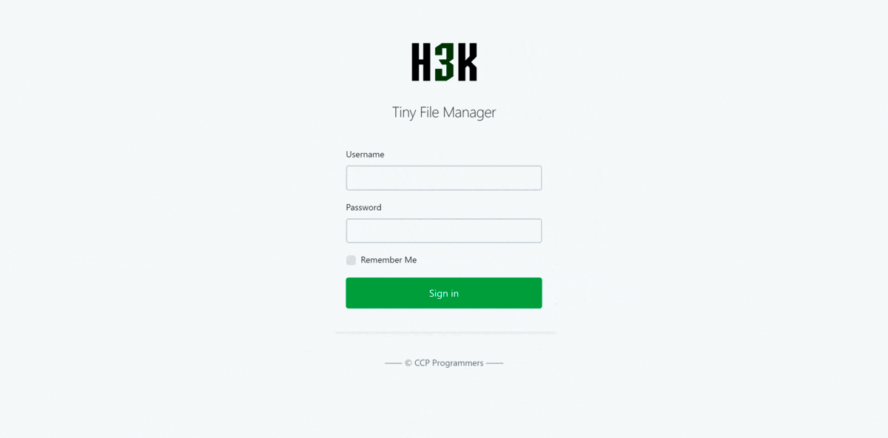

<!--
Este archivo README esta generado automaticamente<https://github.com/YunoHost/apps/tree/master/tools/readme_generator>
No se debe editar a mano.
-->

# Tiny File Manager para Yunohost

[](https://ci-apps.yunohost.org/ci/apps/tinyfilemanager/)  

[](https://install-app.yunohost.org/?app=tinyfilemanager)

*[Leer este README en otros idiomas.](./ALL_README.md)*

> *Este paquete le permite instalarTiny File Manager rapidamente y simplement en un servidor YunoHost.*  
> *Si no tiene YunoHost, visita [the guide](https://yunohost.org/install) para aprender como instalarla.*

## Descripción general

# Tiny File Manager

TinyFileManager is web based file manager and it is a simple, fast and small file manager with a single file, multi-language ready web application for storing, uploading, editing and managing files and folders online via web browser. The Application allows the creation of multiple users and each user can have its own directory and a build-in support for managing text files with cloud9 IDE and it supports syntax highlighting for over 150+ languages and over 35+ themes.

### Features

- :iphone: Mobile friendly view for touch devices
- :information_source: Basic features likes Create, Delete, Modify, View, Quick Preview, Download, Copy and Move files
- :arrow_double_up: Ajax Upload, Ability to drag & drop, upload from URL, multiple files upload with file extensions filter
- :file_folder: Ability to create folders and files
- :gift: Ability to compress, extract files (`zip`, `tar`)
- :sunglasses: Support user permissions - based on session and each user root folder mapping
- :floppy_disk: Copy direct file URL
- :pencil2: Cloud9 IDE - Syntax highlighting for over `150+` languages, Over `35+` themes with your favorite programming style
- :page_facing_up: Google/Microsoft doc viewer helps you preview `PDF/DOC/XLS/PPT/etc`. 25 MB can be previewed with the Google Drive viewer
- :zap: Backup files and IP blacklist and whitelist
- :mag_right: Search - Search and filter files using `datatable js`
- :file_folder: Exclude folders and files from listing


**Versión actual:** 2.5.3~ynh3

**Demo:** <https://tinyfilemanager.github.io/demo/>

## Capturas



## Documentaciones y recursos

- Sitio web oficial: <https://tinyfilemanager.github.io/>
- Documentación administrador oficial: <https://github.com/prasathmani/tinyfilemanager/wiki>
- Repositorio del código fuente oficial de la aplicación : <https://github.com/prasathmani/tinyfilemanager>
- Catálogo YunoHost: <https://apps.yunohost.org/app/tinyfilemanager>
- Reportar un error: <https://github.com/YunoHost-Apps/tinyfilemanager_ynh/issues>

## Información para desarrolladores

Por favor enviar sus correcciones a la [`branch testing`](https://github.com/YunoHost-Apps/tinyfilemanager_ynh/tree/testing

Para probar la rama `testing`, sigue asÍ:

```bash
sudo yunohost app install https://github.com/YunoHost-Apps/tinyfilemanager_ynh/tree/testing --debug
o
sudo yunohost app upgrade tinyfilemanager -u https://github.com/YunoHost-Apps/tinyfilemanager_ynh/tree/testing --debug
```

**Mas informaciones sobre el empaquetado de aplicaciones:** <https://yunohost.org/packaging_apps>
