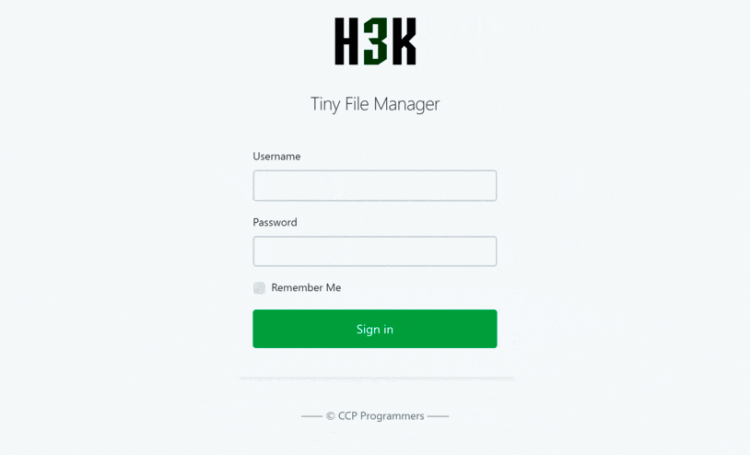

<!--
Ohart ongi: README hau automatikoki sortu da <https://github.com/YunoHost/apps/tree/master/tools/readme_generator>ri esker
EZ editatu eskuz.
-->

# Tiny File Manager YunoHost-erako

[](https://ci-apps.yunohost.org/ci/apps/tinyfilemanager/)  

[](https://install-app.yunohost.org/?app=tinyfilemanager)

*[Irakurri README hau beste hizkuntzatan.](./ALL_README.md)*

> *Pakete honek Tiny File Manager YunoHost zerbitzari batean azkar eta zailtasunik gabe instalatzea ahalbidetzen dizu.*  
> *YunoHost ez baduzu, kontsultatu [gida](https://yunohost.org/install) nola instalatu ikasteko.*

## Aurreikuspena

# Tiny File Manager

TinyFileManager is web based file manager and it is a simple, fast and small file manager with a single file, multi-language ready web application for storing, uploading, editing and managing files and folders online via web browser. The Application allows the creation of multiple users and each user can have its own directory and a build-in support for managing text files with cloud9 IDE and it supports syntax highlighting for over 150+ languages and over 35+ themes.

### Features

- :iphone: Mobile friendly view for touch devices
- :information_source: Basic features likes Create, Delete, Modify, View, Quick Preview, Download, Copy and Move files
- :arrow_double_up: Ajax Upload, Ability to drag & drop, upload from URL, multiple files upload with file extensions filter
- :file_folder: Ability to create folders and files
- :gift: Ability to compress, extract files (`zip`, `tar`)
- :sunglasses: Support user permissions - based on session and each user root folder mapping
- :floppy_disk: Copy direct file URL
- :pencil2: Cloud9 IDE - Syntax highlighting for over `150+` languages, Over `35+` themes with your favorite programming style
- :page_facing_up: Google/Microsoft doc viewer helps you preview `PDF/DOC/XLS/PPT/etc`. 25 MB can be previewed with the Google Drive viewer
- :zap: Backup files and IP blacklist and whitelist
- :mag_right: Search - Search and filter files using `datatable js`
- :file_folder: Exclude folders and files from listing


**Paketatutako bertsioa:** 2.5.3~ynh3

**Demoa:** <https://tinyfilemanager.github.io/demo/>

## Pantaila-argazkiak



## Dokumentazioa eta baliabideak

- Aplikazioaren webgune ofiziala: <https://tinyfilemanager.github.io/>
- Administratzaileen dokumentazio ofiziala: <https://github.com/prasathmani/tinyfilemanager/wiki>
- Jatorrizko aplikazioaren kode-gordailua: <https://github.com/prasathmani/tinyfilemanager>
- YunoHost Denda: <https://apps.yunohost.org/app/tinyfilemanager>
- Eman errore baten berri: <https://github.com/YunoHost-Apps/tinyfilemanager_ynh/issues>

## Garatzaileentzako informazioa

Bidali `pull request`a [`testing` abarrera](https://github.com/YunoHost-Apps/tinyfilemanager_ynh/tree/testing).

`testing` abarra probatzeko, ondorengoa egin:

```bash
sudo yunohost app install https://github.com/YunoHost-Apps/tinyfilemanager_ynh/tree/testing --debug
edo
sudo yunohost app upgrade tinyfilemanager -u https://github.com/YunoHost-Apps/tinyfilemanager_ynh/tree/testing --debug
```

**Informazio gehiago aplikazioaren paketatzeari buruz:** <https://yunohost.org/packaging_apps>
